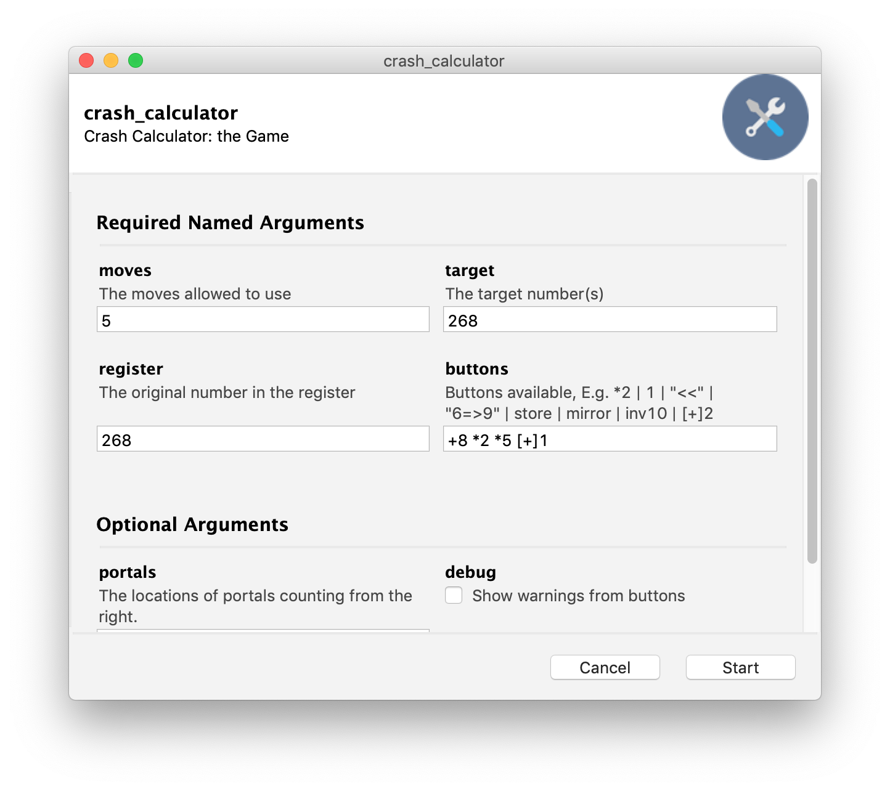
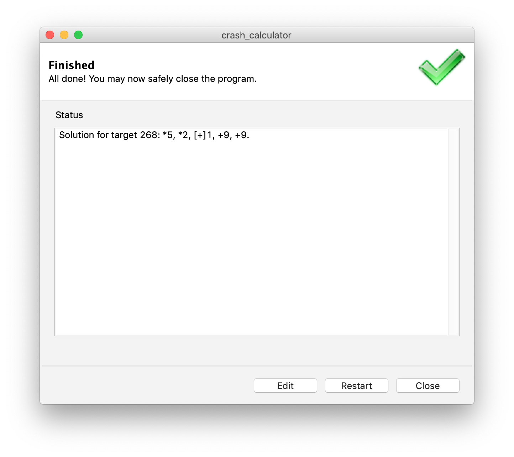
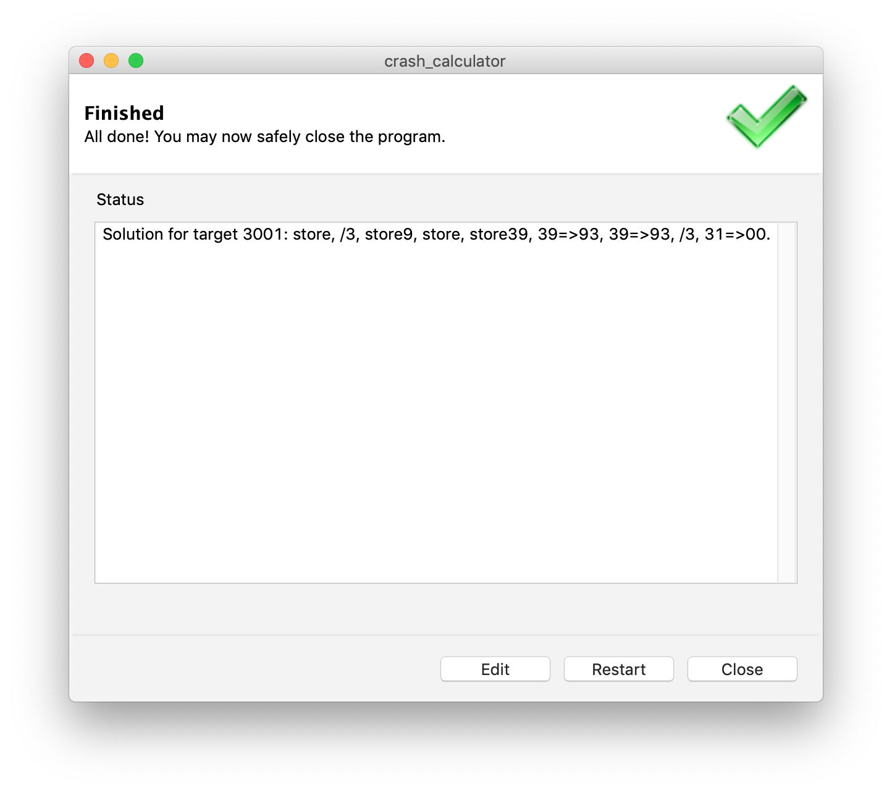

# Cracking `Calculator: The Game`
**Crash** the mobile game - **Calculator: The Game** and **Calculator 2: The Game**

# Installation
- `$ git clone https://github.com/yanrucheng/crash_calculator.git`
- `$ cd crash_calculator`

# Usage
## Command Line Usage
- Checking Documentation
  - `$ python crash_calculator.py -h`
- Example 1
  - `$ python crash_calculator.py --buttons +8 *2 *5 [+]1 --register 25 --moves 5 --target 268`
  - `>>> Solution for target 268: *5, *2, [+]1, +9, +9.`

## GUI Usage
- `$ conda create --name <envname> --file requirements.txt`
- `$ conda activate <envname>`
- `$ pythonw crash_calculator.py`
  - A GUI should pop out. You are ready to go!
  
# Demo

## Question #141 -- Calculator: The Game

## Question #155 -- Calculator: The Game

